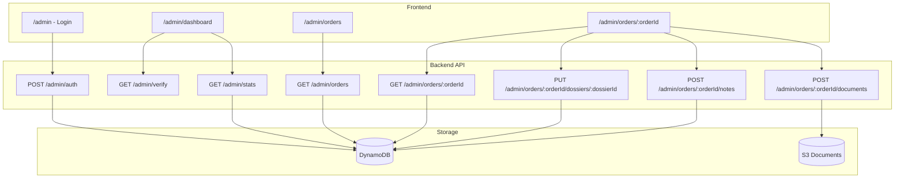

# Design Document - Admin Dashboard EOLIA

## Overview

Espace d'administration léger pour EOLIA, intégré au frontend existant avec des endpoints API dédiés. L'authentification utilise un système simple basé sur des variables d'environnement, sans Cognito. Le design respecte l'identité visuelle EOLIA (emerald, Tailwind CSS, layout max-w-[1400px]).

## Architecture



## Components and Interfaces

### Frontend Components

#### AdminLayout
Wrapper pour toutes les pages admin avec vérification de session.
```typescript
// eolia-frontend/src/components/admin/AdminLayout.tsx
interface AdminLayoutProps {
  children: React.ReactNode;
}
// Vérifie le token admin en localStorage, redirige vers /admin si invalide
```

#### AdminLogin
Page de connexion admin.
```typescript
// eolia-frontend/src/pages/admin/AdminLogin.tsx
// Route: /admin
// Formulaire username/password
// Appelle POST /admin/auth
// Stocke le token en localStorage: 'admin_token'
```

#### AdminDashboard
Dashboard principal avec KPIs.
```typescript
// eolia-frontend/src/pages/admin/AdminDashboard.tsx
// Route: /admin/dashboard
interface KPIData {
  confirmedOrders: number;      // Commandes payées
  pendingInstallations: number; // Installations en attente
  pendingEnedis: number;        // Enedis en attente
  pendingConsuel: number;       // Consuel en attente
}
```

#### AdminOrdersList
Liste des commandes avec filtres.
```typescript
// eolia-frontend/src/pages/admin/AdminOrdersList.tsx
// Route: /admin/orders
interface OrderFilters {
  search?: string;      // Recherche nom/email/orderId
  status?: string;      // Filtre par statut
  dossierType?: string; // Filtre par type de dossier
}
```

#### AdminOrderDetail
Vue détaillée d'une commande/client.
```typescript
// eolia-frontend/src/pages/admin/AdminOrderDetail.tsx
// Route: /admin/orders/:orderId
// Affiche: infos client, commande, dossiers, documents, notes
```

### Backend API Endpoints

#### POST /admin/auth
Authentification admin.
```typescript
// Request
{ username: string; password: string; }

// Response 200
{ token: string; expiresAt: number; }

// Response 401
{ message: "Identifiants incorrects" }
```

#### GET /admin/verify
Vérifie la validité du token admin.
```typescript
// Headers: Authorization: Bearer <token>
// Response 200: { valid: true }
// Response 401: { valid: false }
```

#### GET /admin/stats
Récupère les KPIs du dashboard.
```typescript
// Headers: Authorization: Bearer <token>
// Response 200
{
  confirmedOrders: number;
  pendingInstallations: number;
  pendingEnedis: number;
  pendingConsuel: number;
  totalOrders: number;
  totalRevenue: number;
}
```

#### GET /admin/orders
Liste toutes les commandes (avec pagination).
```typescript
// Headers: Authorization: Bearer <token>
// Query params: ?search=&status=&limit=50&lastKey=
// Response 200
{
  orders: Array<{
    orderId: string;
    createdAt: number;
    userId: string;
    status: string;
    totalAmount: number;
    shippingAddress: {
      firstName: string;
      lastName: string;
      email: string;
      phone: string;
    };
    dossiersSummary: {
      shipping?: string;
      admin_enedis?: string;
      admin_consuel?: string;
      installation?: string;
    };
  }>;
  lastKey?: string;
}
```

#### GET /admin/orders/:orderId
Détail complet d'une commande.
```typescript
// Headers: Authorization: Bearer <token>
// Response 200
{
  order: Order;
  dossiers: Dossier[];
  documents: DossierDocument[];
  notes: AdminNote[];
}
```

#### POST /admin/orders/:orderId/notes
Ajoute une note admin.
```typescript
// Headers: Authorization: Bearer <token>
// Request
{ content: string; dossierId?: string; }

// Response 201
{ note: AdminNote }
```

## Data Models

### AdminNote (nouveau)
```typescript
interface AdminNote {
  noteId: string;
  orderId: string;
  dossierId?: string;  // Si lié à un dossier spécifique
  content: string;
  createdAt: number;
  createdBy: string;   // 'admin'
}
```

### Token Admin
```typescript
// Généré côté backend, stocké en localStorage côté frontend
interface AdminToken {
  token: string;       // UUID ou JWT simple
  createdAt: number;
  expiresAt: number;   // 24h par défaut
}
```

### Extension Order (metadata)
```typescript
// Ajout d'un champ adminNotes dans les commandes existantes
interface OrderWithNotes extends Order {
  adminNotes?: AdminNote[];
}
```

## Error Handling

| Code | Situation | Message |
|------|-----------|---------|
| 401 | Token manquant ou invalide | "Authentification requise" |
| 401 | Identifiants incorrects | "Identifiants incorrects" |
| 403 | Token expiré | "Session expirée, veuillez vous reconnecter" |
| 404 | Commande non trouvée | "Commande non trouvée" |
| 400 | Transition de statut invalide | "Transition non autorisée: {current} → {new}" |
| 413 | Fichier trop volumineux | "Fichier trop volumineux (max 10MB)" |
| 415 | Type de fichier non supporté | "Type de fichier non supporté" |

## Testing Strategy

### Tests Unitaires
- Validation des credentials admin
- Génération et vérification des tokens
- Calcul des KPIs (comptage par statut)
- Validation des transitions de statut

### Tests d'Intégration
- Flow complet d'authentification admin
- Récupération des stats avec données réelles
- Upload de documents vers S3
- Ajout et récupération des notes

### Tests E2E (manuels)
- Login admin → Dashboard → Liste commandes → Détail → Modification statut
- Upload de document et vérification du téléchargement
- Ajout de note et persistance

## Environment Variables

### Backend (.env)
```
ADMIN_USERNAME=eolia_admin
ADMIN_PASSWORD=Eolia2024!
ADMIN_TOKEN_SECRET=<random-32-chars>
```

### Frontend (.env)
```
# Pas de variables spécifiques, utilise VITE_API_URL existant
```

## UI/UX Guidelines

- Couleur principale: emerald-700 (cohérent avec EOLIA)
- Layout: max-w-[1400px] mx-auto px-4
- Cards KPI: bg-white rounded-xl shadow-md avec icône colorée
- Tables: bordures légères, hover:bg-gray-50
- Badges statut: mêmes couleurs que le dashboard client
- Boutons: rounded-full pour actions principales
