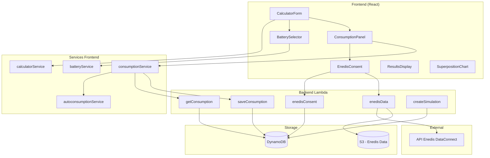
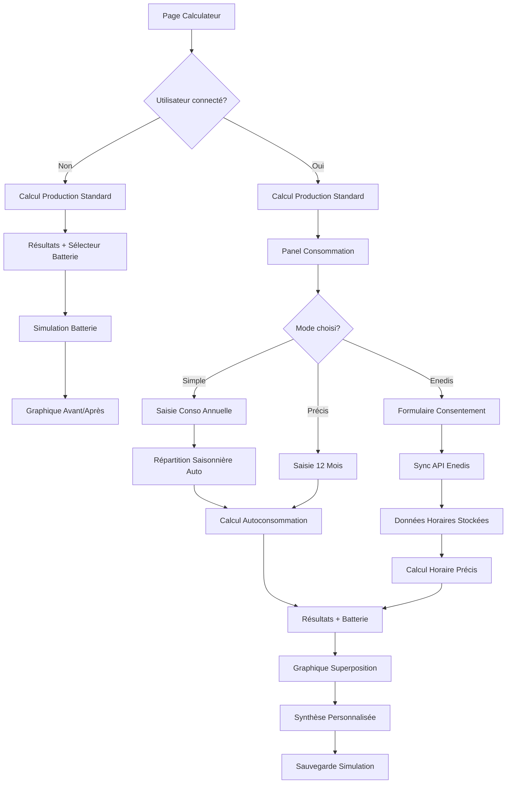

# Design Document - Extension Calculateur EOLIA

## Overview

Cette extension enrichit le calculateur EOLIA existant avec trois nouvelles capacités :
1. **Simulation batterie** accessible à tous (mode public)
2. **Profil de consommation** pour les utilisateurs connectés (Simple, Précis, Expert Enedis)
3. **Calcul d'autoconsommation** avec superposition production/consommation et restitution personnalisée

L'architecture s'intègre au code existant sans modifier le moteur de calcul de production actuel.

## Architecture



## Components and Interfaces

### Nouveaux Composants Frontend

#### 1. BatterySelector
Sélecteur de capacité batterie intégré aux résultats.

```typescript
interface BatterySelectorProps {
  onCapacityChange: (capacity: number | null) => void;
  maxUsefulCapacity: number; // Plafond basé sur production/conso
}

// Capacités disponibles
const BATTERY_CAPACITIES = [5, 10, 15, 20, 25, 30, 35]; // kWh
```

#### 2. ConsumptionPanel
Panel de saisie de consommation (espace client uniquement).

```typescript
interface ConsumptionPanelProps {
  onConsumptionChange: (consumption: ConsumptionData) => void;
  initialData?: ConsumptionData;
}

type ConsumptionMode = 'simple' | 'precise' | 'enedis';

interface ConsumptionData {
  mode: ConsumptionMode;
  annualTotal?: number;           // Mode simple
  monthlyValues?: number[];       // Mode précis (12 valeurs)
  enedisData?: EnedisConsumption; // Mode expert
}
```

#### 3. EnedisConsentForm
Formulaire de consentement pour l'API Enedis.

```typescript
interface EnedisConsentFormProps {
  onConsentSubmit: (consent: EnedisConsent) => void;
  existingConsent?: EnedisConsent;
}

interface EnedisConsent {
  pdl: string;           // Point de Livraison (14 chiffres)
  lastName: string;
  address: string;
  consentDate?: string;  // ISO date
}
```

#### 4. SuperpositionChart
Graphique superposant production et consommation.

```typescript
interface SuperpositionChartProps {
  monthlyProduction: number[];
  monthlyConsumption: number[];
  monthlyAutoconsumption: number[];
  monthlyBatteryGain?: number[];
  monthlySurplus: number[];
}
```

#### 5. PersonalizedSummary
Encart de synthèse personnalisée.

```typescript
interface PersonalizedSummaryProps {
  annualProduction: number;
  annualAutoconsumption: number;
  annualSavings: number;
  batteryGain?: number;
  surplus: number;
}
```

### Nouveaux Services Frontend

#### batteryService.ts

```typescript
const CYCLES_PER_YEAR = 300;
const ELECTRICITY_PRICE = 0.26; // €/kWh

interface BatteryResults {
  batteryGain: number;           // kWh autoconsommés grâce à la batterie
  totalAutoconsumption: number;  // Naturelle + Batterie
  additionalSavings: number;     // € économisés grâce à la batterie
  autoconsumptionRate: number;   // % (avec batterie)
}

function calculateBatteryImpact(
  capacity: number,
  naturalAutoconsumption: number,
  annualProduction: number,
  annualConsumption: number
): BatteryResults;
```

#### consumptionService.ts

```typescript
// Profil saisonnier standard France
const SEASONAL_PROFILE = [
  0.135, 0.12, 0.105, 0.08, 0.065, 0.055,
  0.05, 0.05, 0.06, 0.08, 0.095, 0.105
];

interface ConsumptionProfile {
  monthlyConsumption: number[];  // 12 valeurs kWh
  annualTotal: number;
  source: 'default' | 'simple' | 'precise' | 'enedis';
}

function applySeasonalProfile(annualTotal: number): number[];
function getConsumptionProfile(userId?: string): Promise<ConsumptionProfile>;
function saveConsumptionProfile(userId: string, data: ConsumptionData): Promise<void>;
```

#### autoconsumptionService.ts

```typescript
interface AutoconsumptionResults {
  monthlyAutoconsumption: number[];
  monthlySurplus: number[];
  annualAutoconsumption: number;
  annualSurplus: number;
  autoconsumptionRate: number;  // %
}

// Calcul mensuel (mode Simple/Précis)
function calculateMonthlyAutoconsumption(
  monthlyProduction: number[],
  monthlyConsumption: number[]
): AutoconsumptionResults;

// Calcul horaire (mode Enedis)
function calculateHourlyAutoconsumption(
  hourlyProduction: number[],    // 8760 valeurs
  hourlyConsumption: number[]    // 8760 valeurs Enedis
): AutoconsumptionResults;

// Génération production horaire via Weibull
function generateHourlyProduction(
  monthlyWindSpeed: number[],
  powerKwc: number,
  turbineCount: number
): number[];
```

### Nouveaux Endpoints Backend

#### POST /consumption
Sauvegarde le profil de consommation utilisateur.

```typescript
// Request
interface SaveConsumptionRequest {
  mode: 'simple' | 'precise';
  annualTotal?: number;
  monthlyValues?: number[];
}

// Response
interface SaveConsumptionResponse {
  success: boolean;
  consumptionId: string;
}
```

#### GET /consumption
Récupère le profil de consommation sauvegardé.

```typescript
// Response
interface GetConsumptionResponse {
  mode: 'simple' | 'precise' | 'enedis';
  annualTotal: number;
  monthlyValues: number[];
  source: string;
  updatedAt: string;
}
```

#### POST /enedis/consent
Enregistre le consentement Enedis.

```typescript
// Request
interface EnedisConsentRequest {
  pdl: string;
  lastName: string;
  address: string;
}

// Response
interface EnedisConsentResponse {
  consentId: string;
  status: 'pending' | 'active';
  createdAt: string;
}
```

#### POST /enedis/sync
Synchronise les données Enedis (appel unique, stockage S3).

```typescript
// Request
interface EnedisSyncRequest {
  consentId: string;
}

// Response
interface EnedisSyncResponse {
  success: boolean;
  dataRange: { start: string; end: string };
  recordCount: number;
  s3Key: string;
}
```

#### GET /enedis/data
Récupère les données Enedis stockées.

```typescript
// Response
interface EnedisDataResponse {
  hourlyConsumption: number[];  // 8760 valeurs
  monthlyAggregated: number[];  // 12 valeurs
  lastSync: string;
  pdl: string;
}
```

## Data Models

### Extension DynamoDB - Table Users

```typescript
// Ajout au profil utilisateur existant
interface UserConsumptionData {
  PK: `USER#${userId}`;
  SK: 'CONSUMPTION';
  mode: 'simple' | 'precise' | 'enedis';
  annualTotal: number;
  monthlyValues: number[];      // 12 valeurs
  updatedAt: string;
}
```

### Nouvelle Table - EnedisConsents

```typescript
interface EnedisConsentRecord {
  PK: `USER#${userId}`;
  SK: `CONSENT#${consentId}`;
  pdl: string;
  lastName: string;
  address: string;
  status: 'pending' | 'active' | 'revoked';
  createdAt: string;
  lastSyncAt?: string;
  s3DataKey?: string;
}
```

### Stockage S3 - Données Enedis

```
s3://eolia-enedis-data/
  └── {userId}/
      └── {pdl}/
          └── consumption-{year}.json
```

```typescript
// Format fichier S3
interface EnedisS3Data {
  pdl: string;
  userId: string;
  year: number;
  syncedAt: string;
  hourlyData: {
    timestamp: string;  // ISO
    consumption: number; // Wh
  }[];
}
```

### Extension Type Simulation

```typescript
// Extension de SavedSimulation existant
interface ExtendedSimulationInputs extends SavedSimulation['inputs'] {
  consumption?: {
    mode: 'default' | 'simple' | 'precise' | 'enedis';
    annualTotal: number;
    monthlyValues: number[];
  };
  battery?: {
    capacity: number;  // kWh
  };
}

interface ExtendedSimulationResults extends SavedSimulation['results'] {
  autoconsumption?: {
    natural: number;
    withBattery?: number;
    rate: number;        // %
    surplus: number;
  };
}
```

## Error Handling

### Erreurs Enedis

| Code | Message | Action |
|------|---------|--------|
| ENEDIS_CONSENT_INVALID | PDL invalide ou non reconnu | Afficher formulaire avec erreur |
| ENEDIS_API_UNAVAILABLE | Service Enedis temporairement indisponible | Proposer mode Simple/Précis |
| ENEDIS_DATA_NOT_FOUND | Aucune donnée disponible pour ce PDL | Vérifier période, proposer alternative |
| ENEDIS_CONSENT_EXPIRED | Consentement expiré | Demander renouvellement |

### Validation Frontend

```typescript
// Validation PDL
function validatePDL(pdl: string): boolean {
  return /^\d{14}$/.test(pdl);
}

// Validation consommation
function validateConsumption(values: number[]): ValidationResult {
  const total = values.reduce((a, b) => a + b, 0);
  if (total < 1000 || total > 50000) {
    return { valid: false, message: 'Consommation hors plage réaliste' };
  }
  return { valid: true };
}
```

## Testing Strategy

### Tests Unitaires

1. **batteryService**
   - Calcul gain batterie avec différentes capacités
   - Plafonnement à production/consommation
   - Calcul économies

2. **consumptionService**
   - Application profil saisonnier
   - Validation données mensuelles

3. **autoconsumptionService**
   - Calcul ratio couverture mensuel
   - Calcul horaire avec données simulées
   - Génération Weibull

### Tests d'Intégration

1. **Parcours batterie public**
   - Calcul production → Sélection batterie → Affichage résultats

2. **Parcours consommation client**
   - Connexion → Saisie conso → Calcul autoconso → Sauvegarde

3. **Parcours Enedis**
   - Consentement → Sync → Calcul horaire → Affichage

## Diagramme de Flux UX


