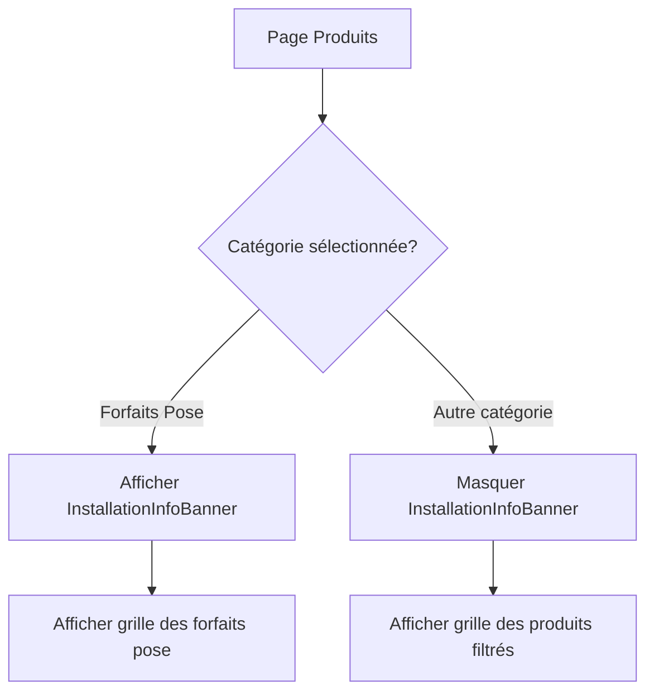

# Design Document - Détails Forfaits Pose

## Overview

Cette fonctionnalité ajoute une section informative et pédagogique qui s'affiche lorsque l'utilisateur sélectionne la catégorie "Forfaits Pose" sur la page Produits. L'objectif est d'expliquer clairement ce que comprend le service d'installation EOLIA, de rassurer le client sur le professionnalisme des intervenants, et de l'informer des prérequis techniques importants.

## Architecture

La solution s'intègre dans l'architecture existante de la page Produits (`Products.tsx`) en ajoutant un composant conditionnel qui s'affiche uniquement lorsque la catégorie "installation" est active.

```
Products.tsx
├── Hero Section (existant)
├── Search & Filters (existant)
├── InstallationInfoBanner (NOUVEAU - conditionnel)
│   ├── Section "Ce que comprend le forfait"
│   ├── Section "Processus d'installation"
│   ├── Section "Démarches administratives"
│   └── Encadré "Mise à la terre"
└── Products Grid (existant)
```

## Components and Interfaces

### Nouveau composant : InstallationInfoBanner

**Emplacement:** `eolia-frontend/src/components/shop/InstallationInfoBanner.tsx`

**Props:** Aucune (composant statique informatif)

**Structure:**

```tsx
interface InstallationStep {
  icon: LucideIcon;
  title: string;
  description: string;
}

interface AdminTask {
  icon: LucideIcon;
  title: string;
  description: string;
}
```

### Intégration dans Products.tsx

Le composant sera affiché conditionnellement :

```tsx
{activeCategory === 'installation' && <InstallationInfoBanner />}
```

## Data Models

Pas de nouveau modèle de données requis. Les informations sont statiques et définies directement dans le composant.

### Contenu statique du composant

**Section 1 - Ce que comprend le forfait :**
- Installation par partenaire certifié RGE avec assurance décennale
- Encadrement et formation par EOLIA
- Raccordement au TGBT dans les règles de l'art
- Mise en service complète

**Section 2 - Processus en 4 étapes :**
1. Validation du projet par notre bureau d'études
2. Planification de l'intervention avec le partenaire RGE
3. Installation et raccordement au TGBT
4. Mise en service et formation

**Section 3 - Démarches administratives incluses :**
- Demande de raccordement Enedis
- Assistance contrat revente surplus
- Demande visite Consuel

**Section 4 - Encadré mise à la terre :**
- Vérification le jour J
- Seuil 100 ohms
- Procédure si non conforme
- Importance vitale

**Section 5 - Recommandation assurance :**
- Conseil d'informer l'assureur habitation (parallèle panneaux solaires)

## UI/UX Design

### Layout

```
┌─────────────────────────────────────────────────────────────┐
│  🔧 Nos forfaits pose : un accompagnement complet           │
│                                                             │
│  ┌─────────────────────────────────────────────────────┐   │
│  │ Ce que comprend votre forfait                        │   │
│  │ ┌─────────┐ ┌─────────┐ ┌─────────┐ ┌─────────┐     │   │
│  │ │ RGE     │ │ Encadré │ │ TGBT    │ │ Mise en │     │   │
│  │ │ Décen.  │ │ EOLIA   │ │ Pro     │ │ service │     │   │
│  │ └─────────┘ └─────────┘ └─────────┘ └─────────┘     │   │
│  └─────────────────────────────────────────────────────┘   │
│                                                             │
│  ┌─────────────────────────────────────────────────────┐   │
│  │ Démarches administratives incluses                   │   │
│  │ ✓ Raccordement Enedis  ✓ Contrat surplus  ✓ Consuel │   │
│  └─────────────────────────────────────────────────────┘   │
│                                                             │
│  ┌─────────────────────────────────────────────────────┐   │
│  │ ⚠️ À savoir : Vérification de la mise à la terre    │   │
│  │ Le jour de l'installation, notre technicien...      │   │
│  └─────────────────────────────────────────────────────┘   │
│                                                             │
│  ┌─────────────────────────────────────────────────────┐   │
│  │ 💡 Conseil : Pensez à informer votre assureur...    │   │
│  └─────────────────────────────────────────────────────┘   │
└─────────────────────────────────────────────────────────────┘
```

### Styles

- Fond : `bg-emerald-50` (cohérent avec la page Produits)
- Bordure arrondie : `rounded-2xl`
- Icônes : Lucide React (Shield, CheckCircle, Zap, AlertTriangle, Home)
- Encadré mise à la terre : `bg-amber-50 border-l-4 border-amber-400`
- Encadré conseil assurance : `bg-blue-50 border-l-4 border-blue-400`

### Responsive

- Mobile : Stack vertical, padding réduit
- Desktop : Grid 4 colonnes pour les avantages, 3 colonnes pour les démarches

## Error Handling

Pas de gestion d'erreur spécifique requise - le composant est purement informatif et statique.

## Testing Strategy

### Tests unitaires (optionnels)
- Vérifier le rendu du composant InstallationInfoBanner
- Vérifier l'affichage conditionnel dans Products.tsx

### Tests manuels
- Vérifier l'affichage sur mobile et desktop
- Vérifier que le composant apparaît uniquement pour la catégorie "installation"
- Vérifier la lisibilité du contenu

## Mermaid Diagram - User Flow



## Implementation Notes

1. Le composant doit être léger et ne pas impacter les performances
2. Le contenu doit être facilement modifiable (textes en constantes)
3. Les icônes doivent être cohérentes avec le reste du site (Lucide)
4. L'encadré "mise à la terre" doit être visuellement distinct (couleur ambre/warning)
5. Le conseil assurance doit être informatif mais non alarmant (couleur bleue/info)
