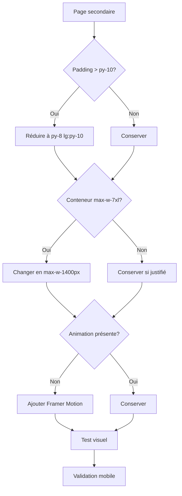

# Design Document - Layout Harmonization

## Overview

Ce document décrit les modifications techniques à apporter pour harmoniser la mise en page des pages secondaires EOLIA avec la page d'accueil. L'objectif est de réduire les espaces vides, utiliser la largeur disponible, et ajouter des animations cohérentes.

## Architecture

### Approche

Modifications CSS ciblées sur les classes Tailwind existantes, sans restructuration des composants. Les changements sont purement visuels et n'affectent pas la logique métier.

### Pattern de référence (Home.tsx)

```tsx
// Section standard
<section className="py-8 lg:py-10 bg-white">
  <div className="max-w-[1400px] mx-auto px-4 sm:px-6 lg:px-8">
    {/* Contenu */}
  </div>
</section>

// Section compacte (trust indicators, filters)
<section className="py-4 bg-white border-b border-gray-100">
  <div className="max-w-[1400px] mx-auto px-4 sm:px-6 lg:px-8">
    {/* Contenu */}
  </div>
</section>
```

## Components and Interfaces

### Mapping des changements par page

#### WhyEolia.tsx
| Section | Avant | Après |
|---------|-------|-------|
| 5 Raisons | `py-16 md:py-20` | `py-8 lg:py-10` |
| Certifications | `py-16 md:py-20` | `py-8 lg:py-10` |
| Garanties | `py-16 md:py-20` | `py-8 lg:py-10` |
| CTA | `py-16 md:py-20` | `py-8 lg:py-10` |
| Conteneur | `max-w-7xl` | `max-w-[1400px]` |

#### Vision.tsx
| Section | Avant | Après |
|---------|-------|-------|
| Vision Environnementale | `py-16 md:py-20` | `py-8 lg:py-10` |
| Innovation Technologique | `py-16 md:py-20` | `py-8 lg:py-10` |
| Impact Social | `py-16 md:py-20` | `py-8 lg:py-10` |
| CTA | `py-16 md:py-20` | `py-8 lg:py-10` |
| Conteneur | `max-w-7xl` | `max-w-[1400px]` |
| Animation | Aucune | Ajouter Framer Motion |

#### AboutUs.tsx
| Section | Avant | Après |
|---------|-------|-------|
| Notre Mission | `py-16 md:py-20` | `py-8 lg:py-10` |
| Nos Valeurs | `py-16 md:py-20` | `py-8 lg:py-10` |
| Notre Engagement | `py-16 md:py-20` | `py-8 lg:py-10` |
| CTA | `py-16 md:py-20` | `py-8 lg:py-10` |
| Conteneur | `max-w-7xl` | `max-w-[1400px]` |
| Animation | Aucune | Ajouter Framer Motion |

#### Contact.tsx
| Section | Avant | Après |
|---------|-------|-------|
| Coordonnées | `py-16 md:py-20` | `py-8 lg:py-10` |
| Horaires | `py-16 md:py-20` | `py-8 lg:py-10` |
| Message | `py-16 md:py-20` | `py-8 lg:py-10` |
| Conteneur | `max-w-7xl` | `max-w-[1400px]` |
| Animation | Déjà présente | Conserver |

#### HowItWorks.tsx
| Section | Avant | Après |
|---------|-------|-------|
| Avantages | `py-16` | `py-8 lg:py-10` |
| Comment ça marche | `py-16` | `py-8 lg:py-10` |
| Conditions optimales | `py-16` | `py-8 lg:py-10` |
| Comparaison | `py-16` | `py-8 lg:py-10` |
| CTA | `py-16` | `py-8 lg:py-10` |
| Conteneur | `max-w-7xl` | `max-w-[1400px]` |
| Animation | Aucune | Ajouter Framer Motion |

#### ConsuelProcess.tsx
| Section | Avant | Après |
|---------|-------|-------|
| Timeline | `py-16` | `py-8 lg:py-10` |
| Documents | `py-16` | `py-8 lg:py-10` |
| Info importante | `py-16` | `py-8 lg:py-10` |
| CTA | `py-16` | `py-8 lg:py-10` |
| Conteneur | `max-w-4xl` | Conserver (texte dense) |
| Animation | Aucune | Ajouter Framer Motion |

#### Ambassador.tsx
| Section | Avant | Après |
|---------|-------|-------|
| Pourquoi devenir | `py-16` | `py-8 lg:py-10` |
| B2C vs B2B | `py-16` | `py-8 lg:py-10` |
| Nos exigences | `py-16` | `py-8 lg:py-10` |
| CTA Final | `py-16` | `py-8 lg:py-10` |
| Conteneur | `container mx-auto` | `max-w-[1400px] mx-auto` |
| Animation | Aucune | Ajouter Framer Motion |

#### Partners.tsx
| Section | Avant | Après |
|---------|-------|-------|
| Section éducative | `py-12 lg:py-16` | `py-8 lg:py-10` |
| Grille partenaires | `py-12 lg:py-16` | `py-8 lg:py-10` |
| CTA | `py-12 lg:py-16` | `py-8 lg:py-10` |
| Conteneur | `max-w-7xl` | `max-w-[1400px]` |
| Animation | Aucune | Ajouter Framer Motion |

### Pattern d'animation Framer Motion

```tsx
import { motion } from 'framer-motion';

// Animation de base pour les sections
<motion.div
  initial={{ opacity: 0, y: 20 }}
  whileInView={{ opacity: 1, y: 0 }}
  viewport={{ once: true }}
  transition={{ duration: 0.6 }}
>
  {/* Contenu de la section */}
</motion.div>

// Animation avec délai pour les éléments en grille
<motion.div
  initial={{ opacity: 0, y: 20 }}
  whileInView={{ opacity: 1, y: 0 }}
  viewport={{ once: true }}
  transition={{ duration: 0.6, delay: index * 0.1 }}
>
  {/* Élément de grille */}
</motion.div>
```

## Data Models

Aucun changement de modèle de données. Les modifications sont purement CSS/visuelles.

## Error Handling

- Vérifier que Framer Motion est déjà installé (utilisé dans WhyEolia, Contact)
- Tester le rendu mobile après chaque modification
- Valider que les animations ne causent pas de problèmes de performance

## Testing Strategy

### Tests visuels manuels

1. Comparer chaque page modifiée avec la page d'accueil
2. Vérifier la cohérence des espacements
3. Tester sur mobile (responsive)
4. Vérifier que les animations sont fluides

### Checklist par page

- [ ] Padding vertical réduit à `py-8 lg:py-10`
- [ ] Conteneur élargi à `max-w-[1400px]` (sauf exceptions)
- [ ] Animations Framer Motion ajoutées
- [ ] Rendu mobile correct
- [ ] Pas de régression visuelle

## Diagramme de flux


