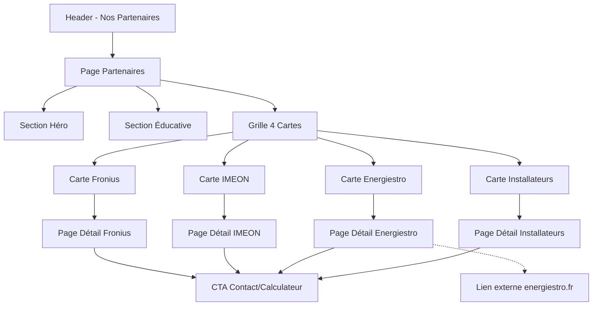

# Design Document - Page Nos Partenaires

## Overview

La page "Nos Partenaires" présente l'écosystème de confiance d'EOLIA : des équipements et services sélectionnés pour leur excellence et leur adaptation aux spécificités de l'énergie éolienne. La page éduque les visiteurs sur l'intermittence du vent et l'importance d'équipements adaptés, puis présente 4 partenaires clés via des cartes attractives menant à des pages détaillées.

## Architecture

### Structure des fichiers

```
eolia-frontend/src/
├── pages/
│   ├── Partners.tsx              # Page principale (refonte)
│   ├── partners/
│   │   ├── FroniusDetail.tsx     # Page détaillée Fronius
│   │   ├── ImeonDetail.tsx       # Page détaillée IMEON
│   │   ├── EnergiestroDetail.tsx # Page détaillée Energiestro
│   │   └── InstallersDetail.tsx  # Page détaillée Installateurs
├── components/
│   └── partners/
│       └── PartnerCard.tsx       # Composant carte partenaire réutilisable
```

### Routes à ajouter (App.tsx)

```typescript
// Nouvelles routes partenaires
<Route path="/partenaires" element={<Partners />} />
<Route path="/partenaires/fronius" element={<FroniusDetail />} />
<Route path="/partenaires/imeon" element={<ImeonDetail />} />
<Route path="/partenaires/energiestro" element={<EnergiestroDetail />} />
<Route path="/partenaires/installateurs" element={<InstallersDetail />} />
```

## Components and Interfaces

### 1. Header Navigation Update

Ajouter "Nos Partenaires" dans `navLinks` du Header.tsx :

```typescript
const navLinks = [
  { to: '/', label: 'Accueil' },
  { to: '/calculateur', label: 'Calculateur' },
  { to: '/produits', label: 'Gamme Tulipe' },
  { to: '/faq', label: 'FAQ' },
  { to: '/partenaires', label: 'Nos Partenaires' },  // NOUVEAU
  { to: '/ambassadeur', label: 'Ambassadeur' },
  { to: '/espace-client', label: 'Espace Client' },
]
```

### 2. PartnerCard Component

```typescript
interface PartnerCardProps {
  id: string;
  name: string;
  tagline: string;
  description: string;
  icon: LucideIcon;
  highlights: string[];
  color: 'sky' | 'emerald' | 'amber' | 'violet';
  detailPath: string;
  externalUrl?: string;
}
```

Design de la carte :
- Fond blanc avec bordure subtile
- Icône colorée en haut (cercle avec fond teinté)
- Nom du partenaire en gras
- Tagline en gris
- 3-4 highlights avec checkmarks
- Bouton "En savoir plus" avec flèche
- Effet hover : légère élévation + bordure colorée

### 3. Partners Page Structure

```
┌─────────────────────────────────────────────────────────────┐
│                    HERO SECTION                              │
│  "Nos Partenaires"                                          │
│  Sous-titre : écosystème de confiance pour l'éolien         │
│  Gradient sky-600 → sky-500                                 │
└─────────────────────────────────────────────────────────────┘

┌─────────────────────────────────────────────────────────────┐
│              SECTION ÉDUCATIVE                               │
│  Titre : "L'éolien, une énergie qui demande des             │
│           équipements adaptés"                               │
│                                                              │
│  ┌──────────┐  ┌──────────┐  ┌──────────┐                   │
│  │ Vent     │  │ Soleil   │  │ Eau      │                   │
│  │ Variable │  │ Prévisible│ │ Constant │                   │
│  │ +++      │  │ ++       │  │ +        │                   │
│  └──────────┘  └──────────┘  └──────────┘                   │
│                                                              │
│  Texte explicatif sur l'intermittence et la nécessité       │
│  d'onduleurs robustes et de stockage intelligent            │
└─────────────────────────────────────────────────────────────┘

┌─────────────────────────────────────────────────────────────┐
│              GRILLE DES PARTENAIRES                          │
│                                                              │
│  ┌─────────────┐  ┌─────────────┐                           │
│  │  FRONIUS    │  │   IMEON     │                           │
│  │  Onduleurs  │  │  Onduleurs  │                           │
│  │  Autrichien │  │  IA Breton  │                           │
│  └─────────────┘  └─────────────┘                           │
│                                                              │
│  ┌─────────────┐  ┌─────────────┐                           │
│  │ ENERGIESTRO │  │INSTALLATEURS│                           │
│  │  Stockage   │  │  Réseau     │                           │
│  │  Inertie    │  │  France     │                           │
│  └─────────────┘  └─────────────┘                           │
│                                                              │
└─────────────────────────────────────────────────────────────┘

┌─────────────────────────────────────────────────────────────┐
│                    CTA SECTION                               │
│  "Besoin de conseils pour votre installation ?"             │
│  [Calculer ma production]  [Nous contacter]                 │
└─────────────────────────────────────────────────────────────┘
```

## Data Models

### Partner Data Structure

```typescript
interface Partner {
  id: string;
  name: string;
  tagline: string;
  shortDescription: string;
  fullDescription: string;
  country: string;
  founded: string;
  icon: LucideIcon;
  color: 'sky' | 'emerald' | 'amber' | 'violet';
  highlights: {
    icon: LucideIcon;
    title: string;
    description: string;
  }[];
  features: {
    icon: LucideIcon;
    title: string;
    description: string;
  }[];
  certifications?: string[];
  externalUrl?: string;
  detailPath: string;
}
```

### Partners Data (à placer dans data/partners.ts)

```typescript
export const partners: Partner[] = [
  {
    id: 'fronius',
    name: 'Fronius',
    tagline: 'La robustesse autrichienne depuis 1945',
    shortDescription: 'Onduleurs de référence mondiale, conçus pour durer et parfaitement adaptés aux variations de l\'éolien.',
    country: 'Autriche',
    founded: '1945',
    icon: Zap,
    color: 'sky',
    highlights: [
      '75+ ans d\'expertise',
      'Adapté aux variations éoliennes',
      'Garantie 10 ans extensible',
      '+3 millions d\'unités installées'
    ],
    detailPath: '/partenaires/fronius'
  },
  {
    id: 'imeon',
    name: 'IMEON',
    tagline: 'L\'intelligence artificielle bretonne',
    shortDescription: 'Onduleurs hybrides avec IA intégrée, conçus et fabriqués en Bretagne depuis 2013.',
    country: 'France (Bretagne)',
    founded: '2013',
    icon: Cpu,
    color: 'emerald',
    highlights: [
      'IA qui apprend vos habitudes',
      'Made in Bretagne',
      'Coté en bourse',
      'Garantie 10-20 ans'
    ],
    detailPath: '/partenaires/imeon'
  },
  {
    id: 'energiestro',
    name: 'Energiestro',
    tagline: 'Le stockage révolutionnaire par inertie',
    shortDescription: 'Volant d\'inertie en béton enterré : 10 kWh de stockage, garanti à vie, zéro usure.',
    country: 'France',
    founded: '2014',
    icon: Battery,
    color: 'amber',
    highlights: [
      'Garanti à vie',
      'Aucune usure ni dégradation',
      'Zéro risque incendie',
      '100% écologique'
    ],
    detailPath: '/partenaires/energiestro',
    externalUrl: 'https://energiestro.fr'
  },
  {
    id: 'installateurs',
    name: 'Réseau Installateurs',
    tagline: 'Des professionnels certifiés près de chez vous',
    shortDescription: 'Électriciens qualifiés et formés par EOLIA pour une installation dans les règles de l\'art.',
    country: 'France',
    icon: Users,
    color: 'violet',
    highlights: [
      'Formation EOLIA certifiée',
      'Couverture nationale',
      'Garantie décennale',
      'SAV réactif'
    ],
    detailPath: '/partenaires/installateurs'
  }
];
```

## Detailed Partner Pages Content

### Fronius Detail Page

**Hero:** Gradient rouge/orange (couleurs Fronius)

**Sections:**
1. **Présentation**
   - Fondé en 1945 à Pettenbach, Autriche
   - Leader mondial des onduleurs photovoltaïques et éoliens
   - Plus de 6 000 employés dans le monde
   - Présence dans plus de 60 pays

2. **Pourquoi Fronius pour l'éolien ?**
   - Gestion exceptionnelle des variations de puissance (MPPT avancé)
   - Robustesse éprouvée : conçu pour fonctionner 20+ ans
   - Rendement jusqu'à 98.1%
   - Plage de tension d'entrée large (adaptée aux variations éoliennes)

3. **Gamme recommandée**
   - Fronius Primo (monophasé, 3-8.2 kW)
   - Fronius Symo (triphasé, 3-20 kW)
   - Fronius GEN24 Plus (hybride avec stockage)

4. **Garanties & SAV**
   - Garantie standard 5 ans, extensible à 10 ans
   - Réseau de techniciens certifiés en France
   - Plateforme Solar.web pour monitoring gratuit
   - Pièces détachées disponibles 15 ans

5. **Certifications**
   - VDE, TÜV, CE
   - Conforme aux normes françaises (NF C 15-100)

### IMEON Detail Page

**Hero:** Gradient bleu/vert (couleurs IMEON)

**Sections:**
1. **Présentation**
   - Fondé en 2013 à Brest, Bretagne
   - Entreprise cotée en bourse (Euronext Growth)
   - Pionnier de l'onduleur hybride intelligent
   - 100% conception et assemblage français

2. **L'Intelligence Artificielle IMEON**
   - Algorithme propriétaire d'apprentissage
   - Analyse des habitudes de consommation
   - Prédiction météo intégrée
   - Optimisation automatique autoconsommation/stockage/revente

3. **Avantages pour l'éolien**
   - Gestion intelligente de l'intermittence
   - Compatibilité batteries lithium 20 ans
   - Mode backup en cas de coupure réseau
   - Monitoring temps réel via app mobile

4. **Gamme**
   - IMEON 3.6 (monophasé, 3.6 kW)
   - IMEON 9.12 (triphasé, 9.12 kW)

5. **Garanties**
   - Garantie 10 ans standard
   - Extension possible à 20 ans
   - SAV basé en France (Brest)
   - Hotline technique dédiée

### Energiestro Detail Page

**Hero:** Gradient ambre/orange

**Sections:**
1. **Présentation**
   - Startup française innovante
   - Technologie VOSS (Volant de Stockage Solide)
   - Alternative révolutionnaire aux batteries chimiques
   - Brevet international

2. **Comment ça marche ?**
   - Cylindre de béton armé enterré dans le jardin
   - Rotation jusqu'à 10 000 tr/min dans le vide
   - Surplus électrique → accélération du volant
   - Besoin d'énergie → le volant ralentit et génère du courant
   - Schéma/animation explicative

3. **Avantages uniques**
   - **Garanti à vie** : pas de dégradation chimique
   - **Écologique** : béton recyclable, pas de lithium ni cobalt
   - **Sécurité totale** : aucun risque d'incendie ou d'explosion
   - **Silencieux** : enterré, inaudible
   - **Capacité** : 10 kWh standard, extensible

4. **Idéal pour l'éolien**
   - Absorbe les pics de production
   - Cycles illimités (vs 5000-10000 pour batteries)
   - Pas de perte de capacité avec le temps
   - Fonctionne par tous temps (-20°C à +50°C)

5. **Installation**
   - Excavation simple (2m x 2m x 2m)
   - Raccordement électrique standard
   - Aucune maintenance requise

### Installateurs Detail Page

**Hero:** Gradient violet

**Sections:**
1. **Notre réseau**
   - Électriciens qualifiés sélectionnés par EOLIA
   - Formation spécifique éolien vertical
   - Couverture de toutes les régions françaises
   - Carte interactive des installateurs

2. **Critères de sélection**
   - Qualification QualiPV ou équivalent
   - Expérience minimum 5 ans
   - Formation EOLIA obligatoire (2 jours)
   - Assurance décennale vérifiée

3. **Ce que comprend l'installation**
   - Étude de faisabilité sur site
   - Montage du mât et de l'éolienne
   - Raccordement électrique complet
   - Mise en service et tests
   - Formation utilisateur

4. **Garanties**
   - Garantie décennale sur l'installation
   - SAV sous 48h en cas de problème
   - Maintenance annuelle optionnelle

5. **Demander un devis**
   - Formulaire de contact
   - Rappel sous 24h

## Error Handling

### Image Loading
- Fallback vers icône Lucide si logo partenaire ne charge pas
- Placeholder coloré avec initiales du partenaire

### Navigation
- Redirection vers /partenaires si route détaillée invalide
- Message d'erreur gracieux si page non trouvée

### External Links
- Ouverture dans nouvel onglet avec `rel="noopener noreferrer"`
- Indication visuelle (icône ExternalLink) pour liens externes

## Testing Strategy

### Tests unitaires (optionnels)
- PartnerCard : rendu correct des props
- Partners page : affichage des 4 cartes
- Navigation : liens corrects vers pages détaillées

### Tests d'intégration (optionnels)
- Navigation Header → Partners → Detail → Back
- Responsive : vérification grille sur mobile/tablette/desktop

### Tests manuels recommandés
- Vérification visuelle cohérence avec design system EOLIA
- Test des liens externes (Fronius, IMEON, Energiestro)
- Test responsive sur différentes tailles d'écran

## Visual Design Specifications

### Couleurs par partenaire
| Partenaire | Couleur principale | Classe Tailwind |
|------------|-------------------|-----------------|
| Fronius | Bleu ciel | sky-600 |
| IMEON | Vert émeraude | emerald-600 |
| Energiestro | Ambre | amber-600 |
| Installateurs | Violet | violet-600 |

### Typographie
- Titres : font-bold, text-gray-900
- Sous-titres : font-semibold, text-gray-700
- Corps : text-gray-600
- Highlights : text-sm, text-gray-500

### Espacements
- Section padding : py-12 lg:py-16
- Grille gap : gap-6 lg:gap-8
- Carte padding : p-6 lg:p-8

### Animations
- Cartes : hover:shadow-lg, hover:-translate-y-1, transition-all duration-300
- Boutons : hover:bg-{color}-700, transition-colors
- Icônes : group-hover:scale-110

## Mermaid Diagram - User Flow


