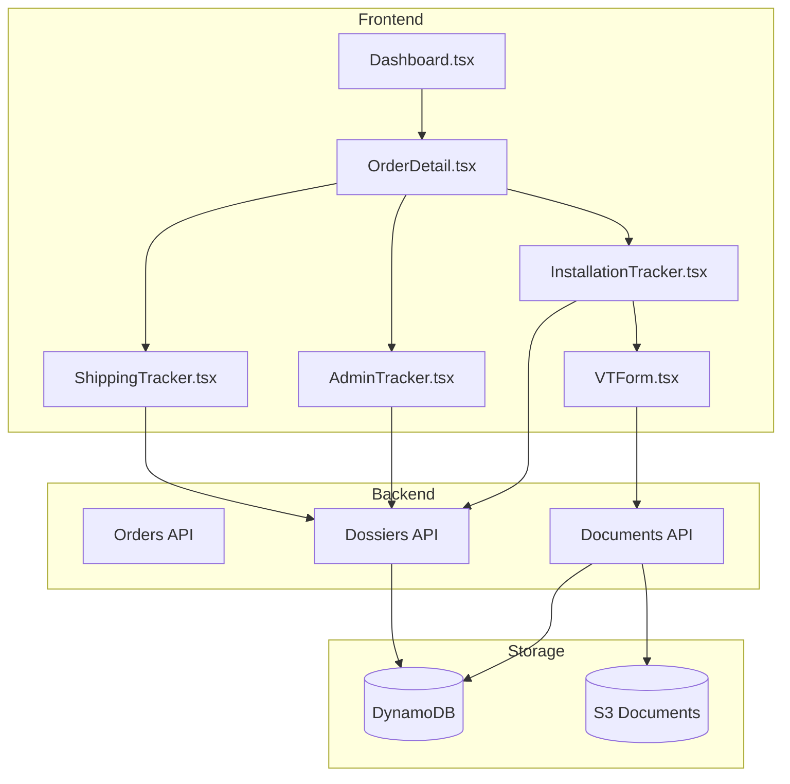
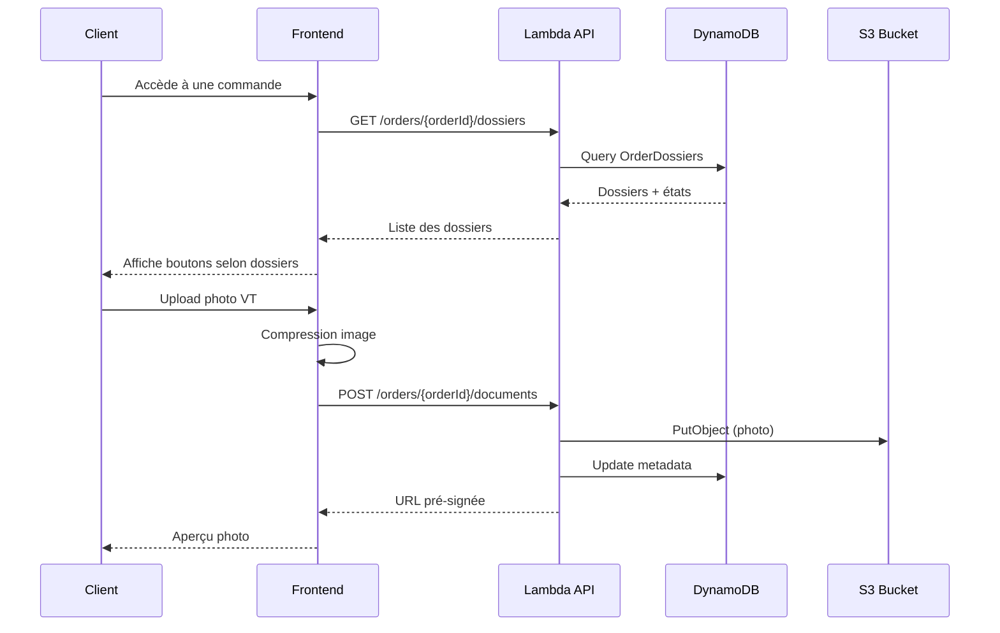

# Design Document - Suivi Post-Achat Eolia

## Overview

Ce document décrit l'architecture et les composants pour implémenter le suivi post-achat dans l'espace client Eolia. L'approche est MVP : structurer les données et l'interface sans sur-ingénierie, en préparant les fondations pour une automatisation future.

### Principes directeurs
- **Simplicité** : Pas de micro-services, architecture monolithique cohérente avec l'existant
- **Évolutivité** : Structure de données extensible pour le futur back-office
- **Mobile-first** : Interface optimisée pour les usages terrain
- **Découplage** : Les 3 types de suivi sont indépendants et cumulables

## Architecture

### Vue d'ensemble



### Flux de données



## Components and Interfaces

### Backend - Nouvelles Lambdas

#### 1. getDossiers
```typescript
// GET /orders/{orderId}/dossiers
interface GetDossiersResponse {
  dossiers: Dossier[];
}

interface Dossier {
  dossierId: string;
  orderId: string;
  type: 'shipping' | 'admin_enedis' | 'admin_consuel' | 'installation';
  status: string;
  createdAt: number;
  updatedAt: number;
  metadata: DossierMetadata;
}
```

#### 2. updateDossierStatus
```typescript
// PUT /orders/{orderId}/dossiers/{dossierId}
interface UpdateDossierRequest {
  status: string;
  metadata?: Partial<DossierMetadata>;
}
```

#### 3. uploadDocument
```typescript
// POST /orders/{orderId}/documents
interface UploadDocumentRequest {
  dossierType: 'shipping' | 'enedis' | 'consuel' | 'installation_vt' | 'installation_reports';
  fileName: string;
  contentType: string;
  // Pour upload direct : retourne URL pré-signée
}

interface UploadDocumentResponse {
  uploadUrl: string;  // URL pré-signée PUT
  documentId: string;
  expiresIn: number;
}
```

#### 4. getDocuments
```typescript
// GET /orders/{orderId}/documents?dossierType=xxx
interface GetDocumentsResponse {
  documents: Document[];
}

interface Document {
  documentId: string;
  fileName: string;
  contentType: string;
  size: number;
  uploadedAt: number;
  downloadUrl: string;  // URL pré-signée GET
}
```

#### 5. submitVT
```typescript
// POST /orders/{orderId}/installation/vt
interface SubmitVTRequest {
  roofType: 'flat' | 'sloped_tiles' | 'sloped_slate' | 'metal' | 'other';
  mountingHeight: number;  // en mètres
  electricalDistance: '<30m' | '30-60m' | '60-100m' | '>100m';
  obstacles: string[];  // ['trees', 'buildings', 'power_lines', etc.]
  comments?: string;
  photoIds: string[];  // IDs des documents uploadés
}
```

### Frontend - Nouveaux Composants

#### Structure des pages

```
src/pages/
├── Dashboard.tsx (existant - modifier)
├── orders/
│   ├── OrderDetail.tsx (nouveau)
│   ├── ShippingTracker.tsx (nouveau)
│   ├── AdminTracker.tsx (nouveau)
│   └── InstallationTracker.tsx (nouveau)
└── components/
    └── tracking/
        ├── TrackingButton.tsx
        ├── StatusBadge.tsx
        ├── Timeline.tsx
        ├── DocumentList.tsx
        ├── PhotoUploader.tsx
        └── VTForm.tsx
```

#### TrackingButton Component
```typescript
interface TrackingButtonProps {
  type: 'shipping' | 'admin' | 'installation';
  orderId: string;
  status?: string;
  onClick: () => void;
}

// Couleurs selon le type
const buttonStyles = {
  shipping: 'bg-blue-600 hover:bg-blue-700',      // 🟦
  admin: 'bg-green-600 hover:bg-green-700',       // 🟩
  installation: 'bg-orange-500 hover:bg-orange-600' // 🟧
};
```

#### Timeline Component
```typescript
interface TimelineEvent {
  id: string;
  timestamp: number;
  status: string;
  label: string;
  description?: string;
}

interface TimelineProps {
  events: TimelineEvent[];
  currentStatus: string;
}
```

#### PhotoUploader Component
```typescript
interface PhotoUploaderProps {
  orderId: string;
  dossierType: string;
  maxPhotos: number;
  minPhotos: number;
  onUploadComplete: (photoIds: string[]) => void;
  existingPhotos?: Document[];
}

// Fonctionnalités :
// - Compression côté client (max 2Mo)
// - Capture mobile (camera)
// - Preview avant upload
// - Progress bar
```

## Data Models

### Table: OrderDossiers

```typescript
interface OrderDossier {
  orderId: string;           // Partition Key
  dossierId: string;         // Sort Key (format: {type}_{uuid})
  type: DossierType;
  status: string;
  createdAt: number;
  updatedAt: number;
  metadata: DossierMetadata;
}

type DossierType = 
  | 'shipping' 
  | 'admin_enedis' 
  | 'admin_consuel' 
  | 'installation';

// Metadata selon le type
interface ShippingMetadata {
  carrier?: string;
  trackingNumber?: string;
  estimatedDelivery?: string;
  deliveryProofUrl?: string;
}

interface AdminMetadata {
  // Enedis ou Consuel
  referenceNumber?: string;
  submissionDate?: number;
  responseDate?: number;
  rejectionReason?: string;
}

interface InstallationMetadata {
  vtData?: VTFormData;
  vtSubmittedAt?: number;
  vtSentToBEAt?: number;
  installerAssigned?: string;
  installationDate?: string;
}
```

### Table: DossierEvents

```typescript
interface DossierEvent {
  dossierId: string;         // Partition Key
  eventId: string;           // Sort Key (format: {timestamp}_{uuid})
  eventType: EventType;
  timestamp: number;
  data: Record<string, any>;
  source: 'system' | 'client' | 'admin';
}

type EventType = 
  | 'status_changed'
  | 'document_added'
  | 'document_removed'
  | 'vt_submitted'
  | 'vt_sent_to_be'
  | 'metadata_updated';
```

### Table: DossierDocuments

```typescript
interface DossierDocument {
  documentId: string;        // Partition Key
  dossierId: string;         // Pour GSI
  orderId: string;           // Pour GSI
  fileName: string;
  contentType: string;
  size: number;
  s3Key: string;
  uploadedAt: number;
  uploadedBy: string;        // userId
}
```

### États par type de dossier

```typescript
// Shipping
type ShippingStatus = 
  | 'received'      // Commande reçue
  | 'preparing'     // En préparation
  | 'shipped'       // Expédiée
  | 'delivered'     // Livrée
  | 'issue';        // Problème/SAV

// Admin (Enedis & Consuel)
type AdminStatus = 
  | 'not_started'   // Non démarré
  | 'in_progress'   // En cours
  | 'validated'     // Validé
  | 'rejected';     // Rejeté

// Installation
type InstallationStatus = 
  | 'vt_pending'    // VT à compléter
  | 'vt_completed'  // VT complétée
  | 'awaiting_be'   // En attente BE
  | 'validated';    // Validée (placeholder)
```

## Error Handling

### Erreurs API

```typescript
interface APIError {
  statusCode: number;
  code: string;
  message: string;
  details?: Record<string, any>;
}

// Codes d'erreur spécifiques
const ErrorCodes = {
  DOSSIER_NOT_FOUND: 'DOSSIER_NOT_FOUND',
  INVALID_STATUS_TRANSITION: 'INVALID_STATUS_TRANSITION',
  UPLOAD_SIZE_EXCEEDED: 'UPLOAD_SIZE_EXCEEDED',
  INVALID_FILE_TYPE: 'INVALID_FILE_TYPE',
  MIN_PHOTOS_REQUIRED: 'MIN_PHOTOS_REQUIRED',
  VT_ALREADY_SUBMITTED: 'VT_ALREADY_SUBMITTED',
  UNAUTHORIZED_ACCESS: 'UNAUTHORIZED_ACCESS',
};
```

### Transitions d'état valides

```typescript
const validTransitions: Record<DossierType, Record<string, string[]>> = {
  shipping: {
    received: ['preparing'],
    preparing: ['shipped'],
    shipped: ['delivered', 'issue'],
    delivered: ['issue'],
    issue: ['preparing', 'shipped'],
  },
  admin_enedis: {
    not_started: ['in_progress'],
    in_progress: ['validated', 'rejected'],
    rejected: ['in_progress'],
  },
  admin_consuel: {
    not_started: ['in_progress'],
    in_progress: ['validated', 'rejected'],
    rejected: ['in_progress'],
  },
  installation: {
    vt_pending: ['vt_completed'],
    vt_completed: ['awaiting_be'],
    awaiting_be: ['validated'],
  },
};
```

### Gestion des erreurs frontend

```typescript
// Hook personnalisé pour les erreurs
const useTrackingError = () => {
  const [error, setError] = useState<string | null>(null);
  
  const handleError = (err: APIError) => {
    const messages: Record<string, string> = {
      UPLOAD_SIZE_EXCEEDED: 'Le fichier dépasse la taille maximale de 10 Mo',
      INVALID_FILE_TYPE: 'Format de fichier non supporté (jpg, png, pdf uniquement)',
      MIN_PHOTOS_REQUIRED: 'Veuillez ajouter au moins 3 photos',
      // ...
    };
    setError(messages[err.code] || err.message);
  };
  
  return { error, handleError, clearError: () => setError(null) };
};
```

## Testing Strategy

### Tests unitaires (Backend)

1. **Validation des transitions d'état**
   - Vérifier que seules les transitions valides sont acceptées
   - Tester les cas limites (état initial, état final)

2. **Génération d'URLs pré-signées**
   - Vérifier l'expiration correcte
   - Tester les permissions S3

3. **Validation du formulaire VT**
   - Champs obligatoires
   - Nombre minimum de photos

### Tests d'intégration

1. **Flux complet VT**
   - Upload photos → Remplir formulaire → Soumettre → Envoyer au BE

2. **Création automatique des dossiers**
   - Vérifier que les bons dossiers sont créés selon le contenu de la commande

### Tests E2E (Cypress)

1. **Parcours client shipping**
   - Visualiser timeline
   - Télécharger preuve de livraison

2. **Parcours client VT**
   - Upload photos depuis mobile
   - Remplir questionnaire
   - Valider et envoyer

## Infrastructure

### Nouveau Bucket S3

```yaml
# serverless.yml - Resources additionnelles
ClientDocumentsBucket:
  Type: AWS::S3::Bucket
  Properties:
    BucketName: eolia-client-documents-${self:provider.stage}
    PublicAccessBlockConfiguration:
      BlockPublicAcls: true
      BlockPublicPolicy: true
      IgnorePublicAcls: true
      RestrictPublicBuckets: true
    CorsConfiguration:
      CorsRules:
        - AllowedOrigins:
            - ${self:provider.environment.FRONTEND_URL}
          AllowedMethods:
            - GET
            - PUT
          AllowedHeaders:
            - '*'
          MaxAge: 3600
    LifecycleConfiguration:
      Rules:
        - Id: DeleteOldTempFiles
          Prefix: temp/
          Status: Enabled
          ExpirationInDays: 1
```

### Nouvelles Tables DynamoDB

```yaml
OrderDossiersTable:
  Type: AWS::DynamoDB::Table
  Properties:
    TableName: ${self:service}-order-dossiers-${self:provider.stage}
    BillingMode: PAY_PER_REQUEST
    AttributeDefinitions:
      - AttributeName: orderId
        AttributeType: S
      - AttributeName: dossierId
        AttributeType: S
    KeySchema:
      - AttributeName: orderId
        KeyType: HASH
      - AttributeName: dossierId
        KeyType: RANGE

DossierEventsTable:
  Type: AWS::DynamoDB::Table
  Properties:
    TableName: ${self:service}-dossier-events-${self:provider.stage}
    BillingMode: PAY_PER_REQUEST
    AttributeDefinitions:
      - AttributeName: dossierId
        AttributeType: S
      - AttributeName: eventId
        AttributeType: S
    KeySchema:
      - AttributeName: dossierId
        KeyType: HASH
      - AttributeName: eventId
        KeyType: RANGE

DossierDocumentsTable:
  Type: AWS::DynamoDB::Table
  Properties:
    TableName: ${self:service}-dossier-documents-${self:provider.stage}
    BillingMode: PAY_PER_REQUEST
    AttributeDefinitions:
      - AttributeName: documentId
        AttributeType: S
      - AttributeName: dossierId
        AttributeType: S
      - AttributeName: orderId
        AttributeType: S
    KeySchema:
      - AttributeName: documentId
        KeyType: HASH
    GlobalSecondaryIndexes:
      - IndexName: DossierIdIndex
        KeySchema:
          - AttributeName: dossierId
            KeyType: HASH
        Projection:
          ProjectionType: ALL
      - IndexName: OrderIdIndex
        KeySchema:
          - AttributeName: orderId
            KeyType: HASH
        Projection:
          ProjectionType: ALL
```

### Permissions IAM additionnelles

```yaml
- Effect: Allow
  Action:
    - dynamodb:Query
    - dynamodb:GetItem
    - dynamodb:PutItem
    - dynamodb:UpdateItem
    - dynamodb:DeleteItem
  Resource:
    - !GetAtt OrderDossiersTable.Arn
    - !GetAtt DossierEventsTable.Arn
    - !GetAtt DossierDocumentsTable.Arn
    - !Sub '${OrderDossiersTable.Arn}/index/*'
    - !Sub '${DossierEventsTable.Arn}/index/*'
    - !Sub '${DossierDocumentsTable.Arn}/index/*'

- Effect: Allow
  Action:
    - s3:PutObject
    - s3:GetObject
    - s3:DeleteObject
  Resource:
    - !Sub '${ClientDocumentsBucket.Arn}/*'
```

## Endpoints API

| Méthode | Endpoint | Description |
|---------|----------|-------------|
| GET | `/orders/{orderId}/dossiers` | Liste les dossiers d'une commande |
| GET | `/orders/{orderId}/dossiers/{dossierId}` | Détail d'un dossier |
| PUT | `/orders/{orderId}/dossiers/{dossierId}` | Met à jour le statut (admin only) |
| GET | `/orders/{orderId}/dossiers/{dossierId}/events` | Historique d'un dossier |
| POST | `/orders/{orderId}/documents/upload-url` | Génère URL pré-signée pour upload |
| GET | `/orders/{orderId}/documents` | Liste les documents |
| DELETE | `/orders/{orderId}/documents/{documentId}` | Supprime un document |
| POST | `/orders/{orderId}/installation/vt` | Soumet le formulaire VT |
| POST | `/orders/{orderId}/installation/send-to-be` | Envoie la VT au BE |

## Migration et initialisation

### Création des dossiers à la confirmation de commande

Modifier la Lambda `createOrder` pour créer automatiquement les dossiers selon le contenu :

```typescript
const createDossiersForOrder = async (order: Order) => {
  const dossiers: Partial<OrderDossier>[] = [];
  
  const hasPhysicalProducts = order.items.some(item => 
    ['turbine', 'inverter', 'accessory'].includes(item.category)
  );
  
  const hasAdminForfait = order.items.some(item => 
    item.category === 'administrative'
  );
  
  const hasInstallationForfait = order.items.some(item => 
    item.category === 'installation'
  );
  
  if (hasPhysicalProducts) {
    dossiers.push({
      type: 'shipping',
      status: 'received',
    });
  }
  
  if (hasAdminForfait) {
    dossiers.push(
      { type: 'admin_enedis', status: 'not_started' },
      { type: 'admin_consuel', status: 'not_started' }
    );
  }
  
  if (hasInstallationForfait) {
    dossiers.push({
      type: 'installation',
      status: 'vt_pending',
    });
  }
  
  // Batch write to DynamoDB
  await createDossiers(order.orderId, dossiers);
};
```
