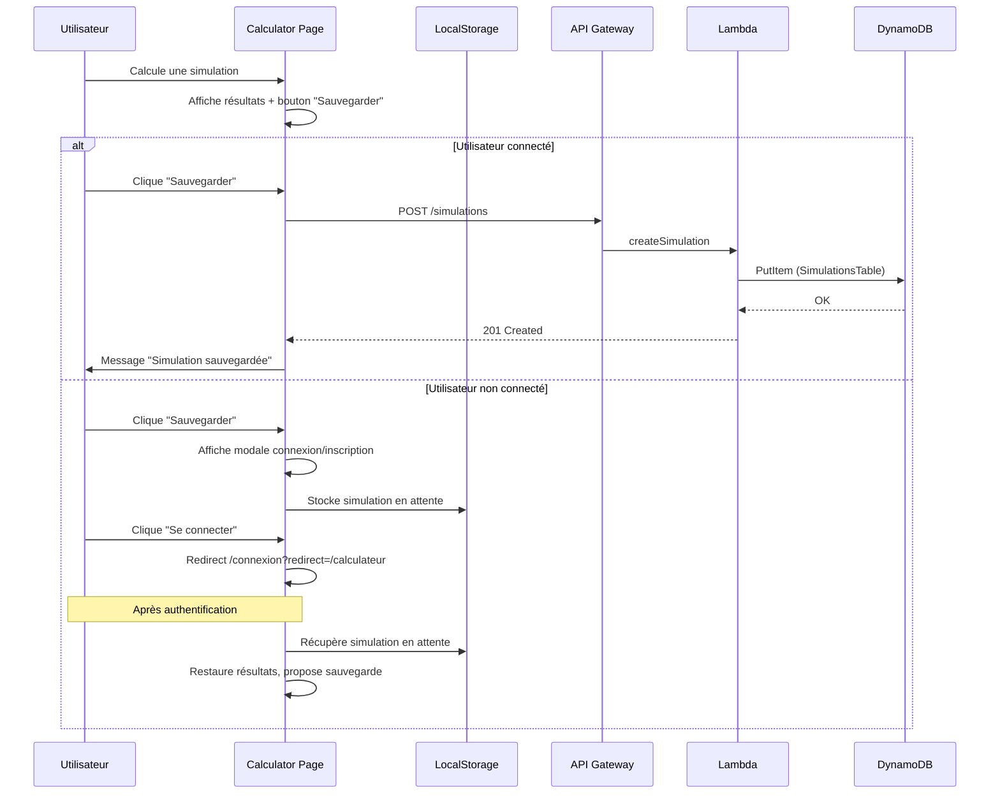

# Design Document - Sauvegarde de Simulations

## Overview

Cette fonctionnalité ajoute la possibilité de sauvegarder les simulations du calculateur éolien dans l'espace client. L'architecture suit le pattern existant d'Eolia : frontend React + backend Serverless (Lambda + DynamoDB).

## Architecture



## Components and Interfaces

### Frontend Components

#### 1. SaveSimulationButton (nouveau)
Bouton affiché dans ResultsDisplay quand des résultats sont disponibles.

```typescript
// eolia-frontend/src/components/calculator/SaveSimulationButton.tsx
interface SaveSimulationButtonProps {
  inputs: CalculatorInputs;
  results: CalculatorResults;
  onSaved: () => void;
}
```

#### 2. AuthRequiredModal (nouveau)
Modale affichée quand un utilisateur non connecté veut sauvegarder.

```typescript
// eolia-frontend/src/components/calculator/AuthRequiredModal.tsx
interface AuthRequiredModalProps {
  isOpen: boolean;
  onClose: () => void;
  redirectPath: string;
}
```

#### 3. SimulationCard (nouveau)
Carte affichant une simulation sauvegardée dans le Dashboard.

```typescript
// eolia-frontend/src/components/dashboard/SimulationCard.tsx
interface SimulationCardProps {
  simulation: SavedSimulation;
  onDelete: (id: string) => void;
  onReload: (simulation: SavedSimulation) => void;
}
```

#### 4. Modifications existantes
- **Calculator.tsx**: Ajouter gestion de la simulation en attente (localStorage) et bouton sauvegarde
- **ResultsDisplay.tsx**: Intégrer SaveSimulationButton
- **Dashboard.tsx**: Ajouter section "Mes simulations"

### Backend Functions

#### 1. createSimulation
```typescript
// POST /simulations
// Headers: Authorization: Bearer <token>
// Body: { inputs: CalculatorInputs, results: CalculatorResults }
// Response: 201 { simulationId, name, createdAt }
```

#### 2. getSimulations
```typescript
// GET /simulations
// Headers: Authorization: Bearer <token>
// Response: 200 { simulations: SavedSimulation[] }
```

#### 3. deleteSimulation
```typescript
// DELETE /simulations/{simulationId}
// Headers: Authorization: Bearer <token>
// Response: 204 No Content
```

### Services

#### simulationService.ts (nouveau)
```typescript
// eolia-frontend/src/services/simulationService.ts
export const simulationService = {
  saveSimulation: (inputs: CalculatorInputs, results: CalculatorResults, token: string) => Promise<SavedSimulation>,
  getSimulations: (token: string) => Promise<SavedSimulation[]>,
  deleteSimulation: (simulationId: string, token: string) => Promise<void>,
  getSimulationCount: (token: string) => Promise<number>,
};
```

## Data Models

### SavedSimulation (Frontend Type)
```typescript
// eolia-frontend/src/types/simulation.ts
export interface SavedSimulation {
  simulationId: string;
  userId: string;
  name: string;
  inputs: {
    departmentCode: string;
    departmentName: string;
    powerKwc: number;
    turbineCount: number;
    anemometerSpeed?: number;
    anemometerMonth?: number;
  };
  results: {
    annualProduction: number;
    annualSavings: number;
    monthlyProduction: number[];
    usedAnemometerData: boolean;
    scalingFactor?: number;
  };
  createdAt: string; // ISO date
}

export interface PendingSimulation {
  inputs: CalculatorInputs;
  results: CalculatorResults;
  timestamp: number;
}
```

### DynamoDB Table Schema
```yaml
SimulationsTable:
  TableName: eolia-backend-simulations-${stage}
  KeySchema:
    - userId (HASH)
    - simulationId (RANGE)
  Attributes:
    - userId: string
    - simulationId: string (UUID)
    - name: string
    - inputs: Map
    - results: Map
    - createdAt: number (timestamp)
```

## Error Handling

| Erreur | Code HTTP | Message utilisateur |
|--------|-----------|---------------------|
| Non authentifié | 401 | Redirection vers modale connexion |
| Limite atteinte (10 simulations) | 400 | "Vous avez atteint la limite de 10 simulations. Supprimez-en une depuis votre espace client." |
| Simulation non trouvée | 404 | "Simulation introuvable" |
| Erreur serveur | 500 | "Une erreur est survenue. Veuillez réessayer." |

## Testing Strategy

### Tests unitaires
- simulationService: mock des appels API
- SaveSimulationButton: états (loading, saved, error)
- AuthRequiredModal: affichage et redirections

### Tests d'intégration
- Flux complet: calcul → sauvegarde → affichage Dashboard
- Flux non connecté: calcul → modale → connexion → restauration → sauvegarde

## LocalStorage Strategy

Pour persister la simulation en attente lors de la redirection vers connexion/inscription :

```typescript
const PENDING_SIMULATION_KEY = 'eolia_pending_simulation';

// Sauvegarder avant redirection
localStorage.setItem(PENDING_SIMULATION_KEY, JSON.stringify({
  inputs,
  results,
  timestamp: Date.now()
}));

// Restaurer au retour (expiration 30 min)
const pending = localStorage.getItem(PENDING_SIMULATION_KEY);
if (pending) {
  const data = JSON.parse(pending);
  if (Date.now() - data.timestamp < 30 * 60 * 1000) {
    // Restaurer et proposer sauvegarde
  }
  localStorage.removeItem(PENDING_SIMULATION_KEY);
}
```

## UI/UX Design

### Bouton Sauvegarde (dans ResultsDisplay)
- Position: sous les résultats, avant la notice info
- Style: bouton secondaire vert (style Eolia)
- Icône: Save (lucide-react)
- États: default, loading, saved (avec checkmark)

### Modale Authentification
- Titre: "Connectez-vous pour sauvegarder"
- Message: "Créez un compte ou connectez-vous pour retrouver cette simulation dans votre espace client."
- Boutons: "Se connecter" (primary), "Créer un compte" (secondary)

### Section Dashboard "Mes simulations"
- Position: dans la grille des services rapides, remplace ou complète le lien "Simulateur"
- Affichage: cartes compactes avec infos clés
- Actions: clic = recharger dans calculateur, icône poubelle = supprimer
